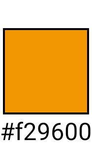
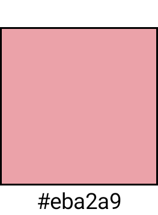
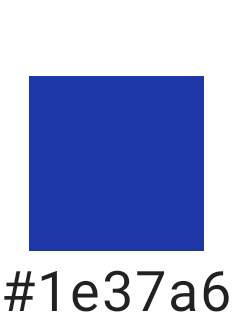
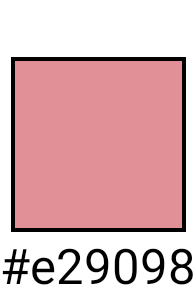
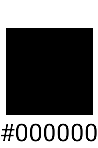
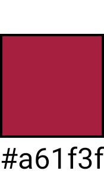
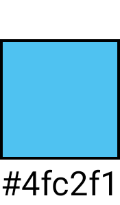
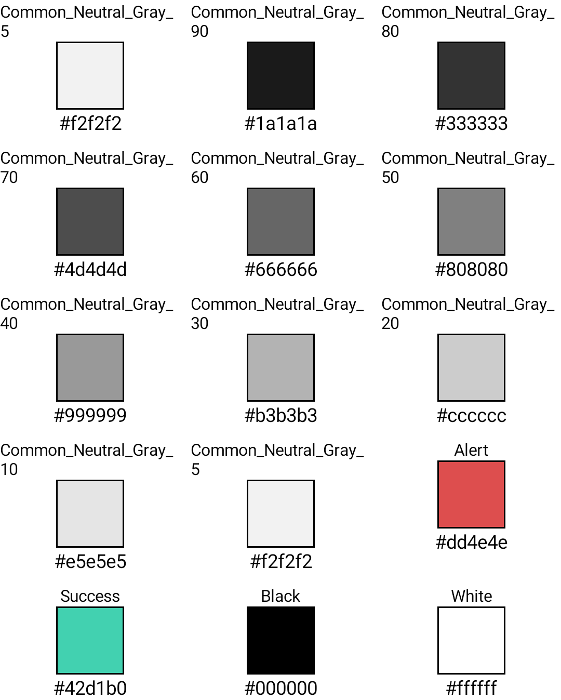

# MobileDesign

## Getting Started

# Snapshot testing
| | | | | | | | | | | |
|-|-|-|-|-|-|-|-|-|-|-|
|common |||||
| WW Light || | | | | | | | | | |
| MORE Light || | | | | | | | | | |
| ED Light || | | | | | | | | | |
| KISS Light || | | | | | | | | | |
| NM Light || | | | | | | | | | |
| OS Light || | | | | | | | | | |
| GOTRIP Light || | | | | | | | | | |

| | |
|-|-|
|commmon grey light||
## target

- Pixel XL API 28

