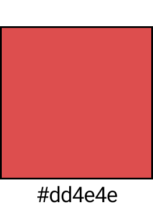
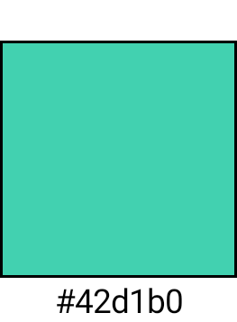
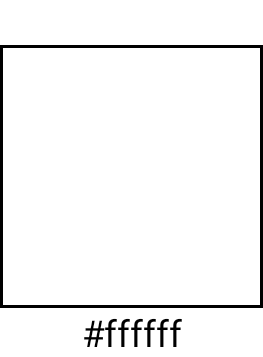
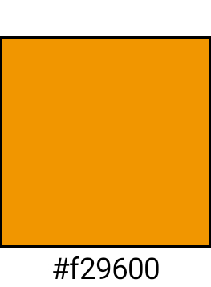
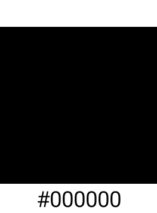
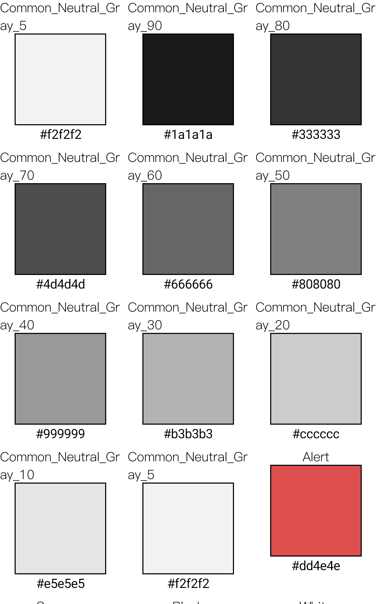

# MobileDesign

## Getting Started

### create you emulator

```
sdkmanager --install "system-images;android-33;google_apis;x86_64"

avdmanager create avd -n Pixel_API_33 -k "system-images;android-33;google_apis;x86_64" -d 23

```

### start you emulator 

```emulator @Pixel_API_33```

### record your snapshot test case

```./gradlew mobile-design:debugExecuteScreenshotTests -Precord```


# Snapshot testing
| | | | | | | | | | | |
|-|-|-|-|-|-|-|-|-|-|-|
|common |||||
| WW Light || | | | | | | | | | |
| MORE Light || | | | | | | | | | |
| ED Light || | | | | | | | | | |
| KISS Light || | | | | | | | | | |
| NM Light || | | | | | | | | | |
| OS Light || | | | | | | | | | |
| GOTRIP Light || | | | | | | | | | |

| | |
|-|-|
|commmon grey light||

| | |
|-|-|
|typographies| |
|body| |
|bodyEmphasize| |
|caption| |
|caption2| |
|caption3Emphasize| |
|captionEmphasize| |
|headline| |
|headlineEmphasize| |
|largeTitleEmphasize| |
|naviTitle| |
|primaryButton| |
|title1| |
|title2| |
|title2Emphasize| |
|title3| |
|title3Emphasize| |
|title4| |
|title4Emphasize| |
|title5| |
|titleEmphasize||

|component| |
|-|-|
|tabbar||
|card||


## target

- Pixel XL API 33


